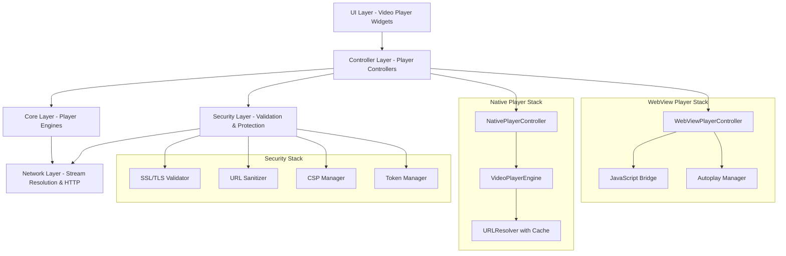
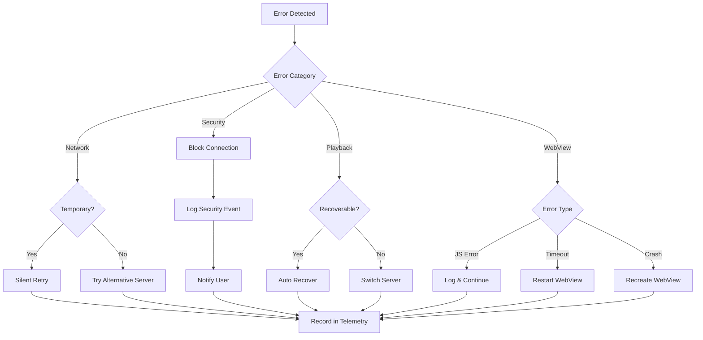

# Diseño Técnico: Optimización y Seguridad del Reproductor de Video

## Overview

Este diseño técnico aborda la optimización del rendimiento y el fortalecimiento de la seguridad del sistema de reproducción de video en la aplicación Flutter Pivote. El sistema actual presenta dos desafíos principales: tiempos de carga inicial prolongados en el reproductor nativo M3U8 y pausas automáticas inesperadas en el reproductor basado en WebView.

El diseño propone una arquitectura modular que separa las preocupaciones de rendimiento, seguridad y experiencia de usuario en componentes especializados. Se implementarán optimizaciones de carga paralela, caché inteligente de URLs, gestión mejorada del buffer, y una capa de seguridad robusta que protege contra vulnerabilidades comunes en aplicaciones de streaming.

### Objetivos Principales

1. Reducir el tiempo de carga inicial de canales M3U8 de ~18 segundos a menos de 5 segundos
2. Eliminar pausas automáticas no solicitadas en el reproductor WebView
3. Implementar comunicación bidireccional robusta entre JavaScript y Flutter
4. Establecer una capa de seguridad completa con validación SSL/TLS, certificate pinning y protección contra inyección de código
5. Mejorar la experiencia de usuario con una interfaz moderna y recuperación inteligente de errores
6. Implementar telemetría completa para diagnóstico proactivo de problemas


## Architecture

### Arquitectura de Alto Nivel

El sistema se estructura en cinco capas principales:



### Principios de Diseño

1. **Separación de Responsabilidades**: Cada componente tiene una responsabilidad única y bien definida
2. **Optimización Temprana**: Las optimizaciones se aplican lo más temprano posible en el pipeline de carga
3. **Seguridad por Capas**: Múltiples capas de validación y protección
4. **Recuperación Resiliente**: Cada punto de fallo tiene una estrategia de recuperación
5. **Observabilidad**: Telemetría completa en todos los componentes críticos


## Components and Interfaces

### 1. OptimizedURLResolver

Componente responsable de resolver URLs de streaming con optimizaciones de caché y detección inteligente.

```dart
class OptimizedURLResolver {
  final URLCache _cache;
  final CDNPatternDetector _cdnDetector;
  final HttpClient _httpClient;
  
  /// Resuelve una URL de streaming con optimizaciones
  Future<ResolvedURL> resolveStreamURL(String rawURL, {
    Duration timeout = const Duration(seconds: 8),
    bool skipResolution = false,
  });
  
  /// Verifica si una URL es directamente utilizable sin resolución
  bool isDirectM3U8URL(String url);
  
  /// Detecta patrones de CDN conocidos
  bool isKnownCDNPattern(String url);
  
  /// Cachea una URL resuelta exitosamente
  void cacheResolvedURL(String rawURL, ResolvedURL resolved);
  
  /// Obtiene una URL del caché si está disponible
  ResolvedURL? getCachedURL(String rawURL);
}

class ResolvedURL {
  final String finalURL;
  final DateTime resolvedAt;
  final Duration resolutionTime;
  final bool fromCache;
}

class URLCache {
  final Duration ttl = const Duration(minutes: 5);
  final Map<String, CachedEntry> _cache = {};
  
  void put(String key, ResolvedURL value);
  ResolvedURL? get(String key);
  void clear();
}
```

### 2. WebViewAutoplayManager

Gestiona la reproducción automática y previene pausas no solicitadas en el WebView Player.

```dart
class WebViewAutoplayManager {
  final WebViewController _webViewController;
  bool _intentionalPlayback = false;
  Timer? _autoResumeTimer;
  
  /// Configura políticas de autoplay en el WebView
  Future<void> configureAutoplayPolicy();
  
  /// Detecta pausas automáticas y las corrige
  void onVideoPaused(PauseEvent event) {
    if (!_intentionalPlayback && event.source != PauseSource.user) {
      _scheduleAutoResume();
    }
  }
  
  /// Programa la reanudación automática
  void _scheduleAutoResume() {
    _autoResumeTimer?.cancel();
    _autoResumeTimer = Timer(Duration(milliseconds: 500), () {
      resumePlayback();
    });
  }
  
  /// Marca una pausa como intencional del usuario
  void markIntentionalPause();
  
  /// Reanuda la reproducción
  Future<void> resumePlayback();
  
  /// Maneja el retorno desde background
  void onAppResumed();
}
```

### 3. JavaScriptBridge

Proporciona comunicación bidireccional robusta entre Flutter y JavaScript en el WebView.

```dart
class JavaScriptBridge {
  final WebViewController _controller;
  final StreamController<PlayerEvent> _eventStream;
  Timer? _heartbeatTimer;
  int _missedHeartbeats = 0;
  
  /// Inicializa el canal de comunicación
  Future<void> initialize();
  
  /// Envía un comando al reproductor JavaScript
  Future<CommandResult> sendCommand(PlayerCommand command);
  
  /// Stream de eventos del reproductor
  Stream<PlayerEvent> get events => _eventStream.stream;
  
  /// Inicia el heartbeat para verificar conectividad
  void startHeartbeat() {
    _heartbeatTimer = Timer.periodic(Duration(seconds: 2), (_) {
      _checkHeartbeat();
    });
  }
  
  /// Verifica el heartbeat y reinicia si es necesario
  Future<void> _checkHeartbeat();
  
  /// Reinicia el WebView en caso de fallo
  Future<void> restartWebView();
  
  /// Maneja mensajes entrantes desde JavaScript
  void handleJavaScriptMessage(String message);
}

enum PlayerCommand { play, pause, mute, unmute, seek }

class PlayerEvent {
  final PlayerEventType type;
  final Map<String, dynamic> data;
  final DateTime timestamp;
}

enum PlayerEventType { 
  stateChanged, 
  error, 
  buffering, 
  heartbeat,
  commandConfirmed 
}
```

### 4. SecurityLayer

Capa de seguridad centralizada que valida y protege todas las operaciones de red y WebView.

```dart
class SecurityLayer {
  final SSLValidator _sslValidator;
  final URLSanitizer _urlSanitizer;
  final CSPManager _cspManager;
  final TokenManager _tokenManager;
  final SecurityLogger _logger;
  
  /// Valida una URL antes de usarla
  Future<ValidationResult> validateStreamURL(String url);
  
  /// Valida certificados SSL/TLS
  Future<bool> validateSSLCertificate(X509Certificate cert, String host);
  
  /// Sanitiza una URL para prevenir inyección
  String sanitizeURL(String url);
  
  /// Configura Content Security Policy para WebView
  String generateCSPHeader();
  
  /// Valida mensajes JavaScript entrantes
  bool validateJavaScriptMessage(String message);
  
  /// Gestiona tokens de autenticación de forma segura
  Future<String?> getAuthToken();
  Future<void> storeAuthToken(String token);
  Future<void> rotateToken();
}

class SSLValidator {
  final Set<String> _pinnedDomains;
  final Map<String, List<String>> _certificateFingerprints;
  
  Future<bool> validateCertificate(X509Certificate cert, String host);
  bool isPinnedDomain(String host);
  bool matchesFingerprint(X509Certificate cert, String host);
}

class URLSanitizer {
  final Set<String> _allowedProtocols = {'http', 'https', 'rtmp', 'rtmps'};
  final Set<String> _blacklistedDomains;
  final int _maxURLLength = 2048;
  
  ValidationResult validate(String url);
  String sanitize(String url);
  bool isBlacklisted(String domain);
}

class TokenManager {
  final FlutterSecureStorage _secureStorage;
  final Encrypter _encrypter; // AES-256
  
  Future<void> storeToken(String token);
  Future<String?> retrieveToken();
  Future<void> rotateToken();
  void clearMemory();
}
```


### 5. AdaptiveBufferManager

Gestiona el buffer de video de forma adaptativa según las condiciones de red.

```dart
class AdaptiveBufferManager {
  final VideoPlayerController _controller;
  final NetworkSpeedDetector _speedDetector;
  
  Duration _minBuffer = Duration(seconds: 3);
  Duration _targetBuffer = Duration(seconds: 10);
  Duration _currentBufferHealth = Duration.zero;
  
  /// Configura el buffer inicial antes de reproducción
  Future<void> configureInitialBuffer();
  
  /// Ajusta el buffer según la velocidad de conexión
  void adjustBufferForNetworkSpeed(double mbps) {
    if (mbps > 5.0) {
      _targetBuffer = Duration(seconds: 15);
    } else if (mbps > 2.0) {
      _targetBuffer = Duration(seconds: 10);
    } else {
      _targetBuffer = Duration(seconds: 5);
    }
  }
  
  /// Monitorea la salud del buffer
  void monitorBufferHealth();
  
  /// Aumenta prioridad de descarga cuando el buffer es bajo
  void boostDownloadPriority();
  
  /// Obtiene métricas del buffer
  BufferMetrics getMetrics();
}

class BufferMetrics {
  final Duration currentBuffer;
  final Duration targetBuffer;
  final double fillRate;
  final bool isHealthy;
}
```

### 6. PlayerWatchdog

Monitorea el estado del reproductor y detecta problemas para recuperación automática.

```dart
class PlayerWatchdog {
  final VideoPlayerController _controller;
  Timer? _watchdogTimer;
  Duration _checkInterval = Duration(seconds: 2);
  
  /// Inicia el monitoreo del reproductor
  void startMonitoring();
  
  /// Detiene el monitoreo
  void stopMonitoring();
  
  /// Verifica el estado del reproductor
  Future<void> _checkPlayerHealth();
  
  /// Ajusta la frecuencia de verificación según el estado
  void adjustCheckInterval(bool bufferHealthy) {
    if (bufferHealthy) {
      _checkInterval = Duration(seconds: 5);
    } else {
      _checkInterval = Duration(seconds: 2);
    }
  }
  
  /// Detecta streams estancados
  bool isStreamStalled();
  
  /// Intenta recuperar un stream estancado
  Future<void> recoverStalledStream();
}
```

### 7. IntelligentRetryManager

Implementa estrategias de reintento con backoff exponencial y circuit breaker.

```dart
class IntelligentRetryManager {
  final Map<String, ServerStats> _serverStats = {};
  final Map<String, CircuitBreaker> _circuitBreakers = {};
  
  /// Intenta conectar con estrategia de reintento
  Future<ConnectionResult> attemptConnection(
    String url,
    {int maxRetries = 3}
  );
  
  /// Implementa backoff exponencial con jitter
  Duration calculateBackoff(int attemptNumber) {
    final baseDelay = Duration(seconds: 2);
    final exponentialDelay = baseDelay * pow(2, attemptNumber);
    final jitter = Random().nextInt(1000);
    return exponentialDelay + Duration(milliseconds: jitter);
  }
  
  /// Registra el resultado de un intento
  void recordAttempt(String server, bool success);
  
  /// Obtiene el servidor más confiable
  String getMostReliableServer(List<String> servers);
  
  /// Verifica si el circuit breaker está abierto
  bool isCircuitOpen(String server);
  
  /// Abre el circuit breaker después de fallos consecutivos
  void openCircuit(String server);
}

class ServerStats {
  int successCount = 0;
  int failureCount = 0;
  DateTime? lastFailure;
  
  double get reliabilityScore => 
    successCount / (successCount + failureCount);
}

class CircuitBreaker {
  int consecutiveFailures = 0;
  DateTime? openedAt;
  final int failureThreshold = 5;
  final Duration cooldownPeriod = Duration(seconds: 60);
  
  bool get isOpen => 
    consecutiveFailures >= failureThreshold &&
    openedAt != null &&
    DateTime.now().difference(openedAt!) < cooldownPeriod;
}
```

### 8. TelemetryCollector

Recopila métricas de rendimiento y las envía a Firebase Analytics.

```dart
class TelemetryCollector {
  final FirebaseAnalytics _analytics;
  final List<MetricEvent> _eventBuffer = [];
  Timer? _flushTimer;
  
  /// Registra el tiempo de carga inicial
  void recordInitialLoadTime(Duration loadTime, String channelId);
  
  /// Registra intentos de reintento
  void recordRetryAttempt(String server, int attemptNumber, bool success);
  
  /// Registra eventos de buffering
  void recordBufferingEvent(Duration duration);
  
  /// Calcula métricas de sesión
  SessionMetrics calculateSessionMetrics();
  
  /// Envía métricas agregadas a Firebase
  Future<void> flushMetrics();
  
  /// Marca un servidor como problemático
  void markServerAsProblematic(String server, double failureRate);
}

class SessionMetrics {
  Duration totalPlaybackTime = Duration.zero;
  Duration totalBufferingTime = Duration.zero;
  int retryCount = 0;
  int successfulConnections = 0;
  int failedConnections = 0;
  
  double get playbackQuality => 
    totalPlaybackTime.inSeconds / 
    (totalPlaybackTime.inSeconds + totalBufferingTime.inSeconds);
}
```


## Data Models

### StreamURL

Representa una URL de streaming con metadatos asociados.

```dart
class StreamURL {
  final String rawURL;
  final String resolvedURL;
  final StreamType type;
  final DateTime? cachedAt;
  final Duration? resolutionTime;
  
  bool get isCached => cachedAt != null;
  bool get isExpired => cachedAt != null && 
    DateTime.now().difference(cachedAt!) > Duration(minutes: 5);
}

enum StreamType { m3u8, dash, iframe, external }
```

### PlayerState

Estado completo del reproductor de video.

```dart
class PlayerState {
  final PlaybackStatus status;
  final Duration position;
  final Duration duration;
  final BufferState bufferState;
  final double volume;
  final bool isMuted;
  final VideoQuality? quality;
  final List<PlayerError> errors;
  
  bool get isPlaying => status == PlaybackStatus.playing;
  bool get isPaused => status == PlaybackStatus.paused;
  bool get isBuffering => status == PlaybackStatus.buffering;
}

enum PlaybackStatus { 
  idle, 
  loading, 
  buffering, 
  playing, 
  paused, 
  error 
}

class BufferState {
  final Duration buffered;
  final Duration target;
  final bool isHealthy;
  final double fillPercentage;
}

class VideoQuality {
  final int width;
  final int height;
  final int bitrate;
  
  String get resolution => '${width}x${height}';
  String get bitrateFormatted => '${(bitrate / 1000000).toStringAsFixed(1)} Mbps';
}
```

### SecurityEvent

Representa un evento de seguridad para logging y análisis.

```dart
class SecurityEvent {
  final SecurityEventType type;
  final SecurityLevel level;
  final String message;
  final DateTime timestamp;
  final Map<String, dynamic> metadata;
  
  bool get isCritical => level == SecurityLevel.critical;
}

enum SecurityEventType {
  sslValidationFailed,
  certificatePinningFailed,
  urlBlacklisted,
  injectionAttempt,
  unauthorizedCommand,
  tokenExpired,
  deviceCompromised,
}

enum SecurityLevel {
  debug,
  info,
  warning,
  error,
  critical,
}
```

### RetryAttempt

Información sobre un intento de conexión.

```dart
class RetryAttempt {
  final String server;
  final int attemptNumber;
  final DateTime timestamp;
  final Duration timeout;
  final bool success;
  final String? errorMessage;
  final Duration? responseTime;
}
```

### TelemetryEvent

Evento de telemetría para análisis de rendimiento.

```dart
class TelemetryEvent {
  final TelemetryEventType type;
  final DateTime timestamp;
  final String channelId;
  final Map<String, dynamic> data;
}

enum TelemetryEventType {
  initialLoad,
  retryAttempt,
  bufferingStart,
  bufferingEnd,
  playbackStart,
  playbackEnd,
  error,
  qualityChange,
}
```


## Correctness Properties

*Una propiedad es una característica o comportamiento que debe ser verdadero en todas las ejecuciones válidas de un sistema - esencialmente, una declaración formal sobre lo que el sistema debe hacer. Las propiedades sirven como puente entre las especificaciones legibles por humanos y las garantías de corrección verificables por máquinas.*

### Property 1: Direct M3U8 URLs Skip Resolution

*Para cualquier* URL que sea claramente identificable como M3U8 directa (contiene extensión .m3u8 o parámetros M3U8), el sistema no debe realizar llamadas HTTP de resolución adicionales.

**Validates: Requirements 1.2**

### Property 2: Known CDN Patterns Skip Verification

*Para cualquier* URL que coincida con patrones de CDN conocidos (Cloudflare, Akamai, AWS CloudFront, etc.), el sistema no debe realizar verificaciones HEAD/GET adicionales.

**Validates: Requirements 1.3**

### Property 3: URL Resolution Caching Round-Trip

*Para cualquier* URL resuelta exitosamente, si se solicita la misma URL dentro de 5 minutos, debe obtenerse del caché sin realizar una nueva resolución HTTP.

**Validates: Requirements 1.4**

### Property 4: First Connection Timeout Limit

*Para cualquier* primer intento de conexión a un stream, el timeout debe ser exactamente 8 segundos.

**Validates: Requirements 1.5**

### Property 5: Fast Failure Immediate Retry

*Para cualquier* primer intento de conexión que falle en menos de 3 segundos, el reintento debe ocurrir inmediatamente sin delay de backoff.

**Validates: Requirements 1.6**

### Property 6: Automatic Pause Detection and Recovery

*Para cualquier* evento de pausa que no sea iniciado por el usuario, el sistema debe detectarlo y reanudar la reproducción automáticamente.

**Validates: Requirements 2.2**

### Property 7: Background Resume Preservation

*Para cualquier* reproductor que estaba en estado "playing" antes de ir a background, al regresar a foreground debe verificar el estado y reanudar la reproducción.

**Validates: Requirements 2.3**

### Property 8: Unsolicited Pause Logging

*Para cualquier* pausa automática no solicitada por el usuario, debe registrarse un evento en los logs con timestamp y contexto.

**Validates: Requirements 2.5**

### Property 9: Auto-Resume Time Limit

*Para cualquier* pausa automática detectada, el intento de reanudación debe ocurrir dentro de 500 milisegundos.

**Validates: Requirements 2.7**

### Property 10: State Event Frequency

*Para cualquier* cambio de estado del video HTML, deben enviarse eventos de estado a Flutter con una frecuencia de al menos 1 evento por segundo.

**Validates: Requirements 3.2**

### Property 11: JavaScript Command Confirmation Round-Trip

*Para cualquier* comando JavaScript enviado desde Flutter (play, pause, mute, unmute, seek), debe recibirse un evento de confirmación de ejecución.

**Validates: Requirements 3.4**

### Property 12: Heartbeat Frequency

*Para cualquier* WebView activo, debe enviarse un heartbeat cada 2 segundos para verificar que está respondiendo.

**Validates: Requirements 3.5**

### Property 13: Heartbeat Failure Recovery

*Para cualquier* secuencia de 3 heartbeats fallidos consecutivos, el sistema debe reiniciar el WebView automáticamente.

**Validates: Requirements 3.6**

### Property 14: Error Event Completeness

*Para cualquier* error que ocurra en el WebView, el evento de error enviado debe contener tanto un código de error como un mensaje descriptivo.

**Validates: Requirements 3.7**

### Property 15: SSL Certificate Validation

*Para cualquier* conexión HTTPS, el sistema debe validar el certificado SSL/TLS antes de establecer la conexión.

**Validates: Requirements 4.1**

### Property 16: Invalid Certificate Rejection

*Para cualquier* certificado SSL que sea inválido o haya expirado, el sistema debe rechazar la conexión y generar un error.

**Validates: Requirements 4.2**

### Property 17: Certificate Pinning Enforcement

*Para cualquier* dominio configurado con certificate pinning, el certificado presentado debe coincidir con los fingerprints esperados o la conexión debe rechazarse.

**Validates: Requirements 4.3**

### Property 18: TLS Version Enforcement

*Para cualquier* conexión HTTPS, la versión de TLS utilizada debe ser 1.2 o superior.

**Validates: Requirements 4.4**

### Property 19: HTTPS Downgrade Protection

*Para cualquier* intento de downgrade de HTTPS a HTTP, el sistema debe bloquear la conexión.

**Validates: Requirements 4.5**

### Property 20: URL Sanitization Before Use

*Para cualquier* URL antes de realizar una solicitud HTTP, debe pasar por el proceso de sanitización.

**Validates: Requirements 4.6**

### Property 21: Rate Limiting Per Domain

*Para cualquier* dominio, el número de solicitudes HTTP no debe exceder 10 por segundo.

**Validates: Requirements 4.7**

### Property 22: JavaScript Message Validation

*Para cualquier* mensaje recibido desde JavaScript, debe pasar por validación y sanitización antes de ser procesado.

**Validates: Requirements 5.3**

### Property 23: Invalid Message Rejection and Logging

*Para cualquier* mensaje JavaScript con formato inválido, debe descartarse y registrarse un evento de intento de mensaje inválido.

**Validates: Requirements 5.4, 5.6**

### Property 24: JavaScript Command Whitelist Enforcement

*Para cualquier* comando JavaScript recibido, solo debe ejecutarse si está en la whitelist de comandos permitidos.

**Validates: Requirements 5.5**

### Property 25: Protocol Validation

*Para cualquier* URL de streaming, el protocolo debe ser uno de los permitidos: http, https, rtmp, o rtmps.

**Validates: Requirements 6.1**

### Property 26: Special Character URL Decoding

*Para cualquier* URL que contenga caracteres especiales o codificación URL, debe decodificarse y validarse antes de usarse.

**Validates: Requirements 6.2**

### Property 27: Blacklist Domain Rejection

*Para cualquier* URL cuyo dominio esté en la blacklist, debe rechazarse la carga y notificarse al usuario.

**Validates: Requirements 6.3, 6.4**

### Property 28: M3U8 Malicious Content Detection

*Para cualquier* URL M3U8, debe validarse que no contenga scripts embebidos o payloads maliciosos antes de usarse.

**Validates: Requirements 6.5**

### Property 29: URL Length Limit Enforcement

*Para cualquier* URL, si la longitud excede 2048 caracteres, debe rechazarse y registrarse el evento.

**Validates: Requirements 6.6, 6.7**

### Property 30: Token Encryption Round-Trip

*Para cualquier* token de autenticación almacenado, al recuperarlo debe ser idéntico al token original (después de desencriptar), validando que la encriptación AES-256 funciona correctamente.

**Validates: Requirements 7.1**

### Property 31: Memory Cleanup on App Close

*Para cualquier* cierre de aplicación, todos los tokens deben limpiarse de la memoria.

**Validates: Requirements 7.3**

### Property 32: Token Rotation Schedule

*Para cualquier* token almacenado por más de 24 horas, debe rotarse automáticamente.

**Validates: Requirements 7.4**

### Property 33: Expired Token Auto-Renewal

*Para cualquier* token que expire, debe solicitarse renovación automática sin intervención del usuario.

**Validates: Requirements 7.5**

### Property 34: Compromised Device Storage Disable

*Para cualquier* dispositivo detectado como comprometido (rooted/jailbroken), el almacenamiento de credenciales debe deshabilitarse.

**Validates: Requirements 7.7**

### Property 35: Failed Connection Logging

*Para cualquier* intento de conexión fallido, debe registrarse un evento con timestamp y razón del fallo.

**Validates: Requirements 8.1**

### Property 36: SSL Validation Event Logging

*Para cualquier* validación de certificado SSL, debe registrarse un evento en los logs.

**Validates: Requirements 8.2**

### Property 37: Code Injection Attempt Logging

*Para cualquier* intento detectado de inyección de código, debe registrarse un evento con detalles completos.

**Validates: Requirements 8.3**

### Property 38: Log Rotation on Size Limit

*Para cualquier* archivo de logs que exceda 10MB de tamaño, debe rotarse automáticamente.

**Validates: Requirements 8.5**

### Property 39: Critical Security Event Remote Reporting

*Para cualquier* evento de seguridad de nivel crítico, debe enviarse a un servicio de analytics remoto.

**Validates: Requirements 8.6**

### Property 40: Critical Event Threshold Notification

*Para cualquier* ventana de 1 minuto con 5 o más eventos de seguridad críticos, debe notificarse al usuario con sugerencias de acciones correctivas.

**Validates: Requirements 8.7**

### Property 41: Minimum Buffer Before Playback

*Para cualquier* inicio de reproducción, el buffer debe ser de al menos 3 segundos antes de comenzar.

**Validates: Requirements 9.1**

### Property 42: Target Buffer During Playback

*Para cualquier* reproducción activa, el buffer objetivo debe mantenerse en 10 segundos.

**Validates: Requirements 9.2**

### Property 43: Low Buffer Priority Boost

*Para cualquier* situación donde el buffer caiga por debajo de 2 segundos, la prioridad de descarga de segmentos debe aumentarse.

**Validates: Requirements 9.3**

### Property 44: Adaptive Buffer Network Adjustment

*Para cualquier* cambio en la velocidad de conexión detectada, el tamaño del buffer objetivo debe ajustarse proporcionalmente.

**Validates: Requirements 9.4**

### Property 45: High Speed Buffer Increase

*Para cualquier* velocidad de conexión mayor a 5 Mbps, el buffer objetivo debe aumentarse a 15 segundos.

**Validates: Requirements 9.5**

### Property 46: Watchdog Check Frequency

*Para cualquier* reproductor activo, el watchdog debe verificar el buffer health cada 2 segundos.

**Validates: Requirements 9.6**

### Property 47: Healthy Buffer Check Frequency Reduction

*Para cualquier* buffer que permanezca saludable por más de 30 segundos, la frecuencia de verificación del watchdog debe reducirse a cada 5 segundos.

**Validates: Requirements 9.7**

### Property 48: Initial Load Time Telemetry

*Para cualquier* reproducción de canal, debe registrarse el tiempo de carga inicial en telemetría.

**Validates: Requirements 11.1**

### Property 49: Retry Attempts Telemetry

*Para cualquier* sesión de reproducción, debe registrarse la cantidad de intentos de reintento realizados.

**Validates: Requirements 11.2**

### Property 50: Buffering Event Telemetry

*Para cualquier* evento de buffering, debe registrarse con duración y frecuencia en telemetría.

**Validates: Requirements 11.3**

### Property 51: Playback Quality Calculation

*Para cualquier* sesión de reproducción, debe calcularse y registrarse la relación entre tiempo de reproducción exitosa y tiempo de buffering.

**Validates: Requirements 11.4**

### Property 52: Metrics Flush Frequency

*Para cualquier* período de 5 minutos de actividad, las métricas agregadas deben enviarse a Firebase Analytics.

**Validates: Requirements 11.5**

### Property 53: URL Resolution Success Rate Tracking

*Para cualquier* conjunto de intentos de resolución de URLs, debe registrarse la tasa de éxito (exitosas vs fallidas).

**Validates: Requirements 11.6**

### Property 54: Problematic Server Detection

*Para cualquier* servidor con tasa de fallo superior al 50%, debe marcarse como problemático y reducirse su prioridad en la lista de servidores.

**Validates: Requirements 11.7**

### Property 55: Temporary Network Error Silent Retry

*Para cualquier* error de red temporal, debe reintentarse automáticamente sin mostrar error al usuario.

**Validates: Requirements 12.1**

### Property 56: Exponential Backoff with Jitter

*Para cualquier* secuencia de reintentos, los intervalos entre intentos deben seguir un patrón de backoff exponencial con jitter aleatorio.

**Validates: Requirements 12.2**

### Property 57: All Servers Failed Recovery Wait

*Para cualquier* situación donde todos los servidores de un canal fallen, debe esperarse 30 segundos antes de reintentar desde el primer servidor.

**Validates: Requirements 12.3**

### Property 58: Server Reliability Statistics

*Para cualquier* servidor, deben mantenerse estadísticas de confiabilidad y usarse para priorizar servidores más confiables.

**Validates: Requirements 12.4**

### Property 59: Consistent Failure Server Deprioritization

*Para cualquier* servidor que falle consistentemente, debe moverse al final de la lista de prioridad.

**Validates: Requirements 12.5**

### Property 60: Circuit Breaker Activation

*Para cualquier* servidor con 5 fallos consecutivos, debe activarse el circuit breaker y pausar intentos por 60 segundos.

**Validates: Requirements 12.6**

### Property 61: Network Restoration Auto-Resume

*Para cualquier* desconexión de internet seguida de restauración de conexión, la reproducción debe reanudarse automáticamente.

**Validates: Requirements 12.7**


## Error Handling

### Error Categories

El sistema maneja cuatro categorías principales de errores:

1. **Network Errors**: Errores de conectividad, timeouts, DNS failures
2. **Security Errors**: Validación SSL fallida, certificate pinning mismatch, URLs maliciosas
3. **Playback Errors**: Codec no soportado, formato inválido, stream corrupto
4. **System Errors**: Memoria insuficiente, permisos faltantes, WebView crash

### Error Handling Strategies

#### Network Errors

```dart
class NetworkErrorHandler {
  Future<void> handleNetworkError(NetworkError error) async {
    if (error.isTemporary) {
      // Reintento automático sin notificar al usuario
      await _retryManager.scheduleRetry(error.url);
    } else if (error.isTimeout) {
      // Timeout - intentar con servidor alternativo
      await _switchToAlternativeServer();
    } else {
      // Error permanente - notificar al usuario
      _showErrorToUser(error);
    }
    
    // Siempre registrar en telemetría
    _telemetry.recordNetworkError(error);
  }
}
```

#### Security Errors

```dart
class SecurityErrorHandler {
  Future<void> handleSecurityError(SecurityError error) async {
    // Los errores de seguridad son críticos - siempre bloquear
    _blockConnection(error.url);
    
    // Registrar evento de seguridad
    _securityLogger.logCritical(error);
    
    // Notificar al usuario con mensaje apropiado
    if (error.type == SecurityErrorType.sslValidationFailed) {
      _showSSLWarning();
    } else if (error.type == SecurityErrorType.maliciousURL) {
      _showMaliciousURLWarning();
    }
    
    // Enviar a analytics remoto
    _analytics.reportSecurityEvent(error);
  }
}
```

#### Playback Errors

```dart
class PlaybackErrorHandler {
  Future<void> handlePlaybackError(PlaybackError error) async {
    if (error.isRecoverable) {
      // Intentar recuperación automática
      if (error.type == PlaybackErrorType.bufferUnderrun) {
        await _bufferManager.boostBuffering();
      } else if (error.type == PlaybackErrorType.streamStalled) {
        await _watchdog.recoverStalledStream();
      }
    } else {
      // Error no recuperable - intentar servidor alternativo
      await _switchToAlternativeServer();
    }
    
    _telemetry.recordPlaybackError(error);
  }
}
```

#### WebView Errors

```dart
class WebViewErrorHandler {
  Future<void> handleWebViewError(WebViewError error) async {
    if (error.type == WebViewErrorType.javaScriptError) {
      // Error de JavaScript - registrar y continuar
      _logger.warning('JavaScript error: ${error.message}');
    } else if (error.type == WebViewErrorType.heartbeatTimeout) {
      // WebView no responde - reiniciar
      await _jsBridge.restartWebView();
    } else if (error.type == WebViewErrorType.crash) {
      // Crash del WebView - reiniciar completamente
      await _recreateWebView();
    }
    
    _telemetry.recordWebViewError(error);
  }
}
```

### Error Recovery Flow



### User-Facing Error Messages

Los mensajes de error al usuario deben ser:
- Claros y no técnicos
- Accionables cuando sea posible
- Apropiados al contexto

```dart
class ErrorMessageProvider {
  String getUserMessage(AppError error) {
    switch (error.type) {
      case ErrorType.networkUnavailable:
        return 'No hay conexión a internet. Verifica tu conexión y vuelve a intentar.';
      
      case ErrorType.sslValidationFailed:
        return 'La conexión no es segura. No se puede reproducir este contenido.';
      
      case ErrorType.streamNotAvailable:
        return 'Este canal no está disponible en este momento. Intenta con otro canal.';
      
      case ErrorType.unsupportedFormat:
        return 'Este formato de video no es compatible con tu dispositivo.';
      
      default:
        return 'Ocurrió un error inesperado. Por favor, intenta nuevamente.';
    }
  }
}
```


## Testing Strategy

### Dual Testing Approach

Este proyecto implementará un enfoque dual de testing que combina unit tests tradicionales con property-based testing para lograr cobertura completa:

- **Unit Tests**: Verifican ejemplos específicos, casos edge, y condiciones de error
- **Property Tests**: Verifican propiedades universales a través de todos los inputs posibles

Ambos tipos de tests son complementarios y necesarios. Los unit tests capturan bugs concretos y casos específicos, mientras que los property tests verifican la corrección general del sistema.

### Property-Based Testing Configuration

**Framework**: Utilizaremos el paquete `test` de Dart junto con generadores personalizados para property-based testing, ya que Dart no tiene una biblioteca PBT madura como QuickCheck o Hypothesis.

**Configuración de Tests**:
- Cada property test debe ejecutar mínimo 100 iteraciones con datos aleatorios
- Cada test debe referenciar la propiedad del documento de diseño mediante un comentario
- Formato del tag: `// Feature: video-player-optimization-security, Property {number}: {property_text}`

**Ejemplo de Property Test**:

```dart
// Feature: video-player-optimization-security, Property 3: URL Resolution Caching Round-Trip
test('resolved URLs are cached and reused within 5 minutes', () async {
  final resolver = OptimizedURLResolver();
  
  for (int i = 0; i < 100; i++) {
    // Generate random URL
    final url = generateRandomM3U8URL();
    
    // First resolution
    final resolved1 = await resolver.resolveStreamURL(url);
    expect(resolved1.fromCache, isFalse);
    
    // Second resolution within 5 minutes
    final resolved2 = await resolver.resolveStreamURL(url);
    expect(resolved2.fromCache, isTrue);
    expect(resolved2.finalURL, equals(resolved1.finalURL));
  }
});

// Feature: video-player-optimization-security, Property 29: URL Length Limit Enforcement
test('URLs exceeding 2048 characters are rejected', () async {
  final sanitizer = URLSanitizer();
  
  for (int i = 0; i < 100; i++) {
    // Generate random URL with length > 2048
    final longURL = generateRandomURL(length: 2049 + Random().nextInt(1000));
    
    final result = sanitizer.validate(longURL);
    expect(result.isValid, isFalse);
    expect(result.reason, contains('length'));
  }
});
```

### Unit Testing Strategy

**Cobertura de Unit Tests**:

1. **Optimización de Carga**:
   - Verificar detección de URLs M3U8 directas
   - Verificar detección de patrones CDN conocidos
   - Verificar expiración de caché después de 5 minutos
   - Verificar timeout de 8 segundos en primer intento

2. **WebView Player**:
   - Verificar configuración de autoplay policy
   - Verificar detección de pausas automáticas
   - Verificar reanudación dentro de 500ms
   - Verificar manejo de retorno desde background

3. **JavaScript Bridge**:
   - Verificar envío de comandos (play, pause, mute, unmute, seek)
   - Verificar recepción de eventos de estado
   - Verificar heartbeat cada 2 segundos
   - Verificar reinicio después de 3 heartbeats fallidos

4. **Security Layer**:
   - Verificar validación de certificados SSL
   - Verificar certificate pinning para dominios conocidos
   - Verificar rechazo de certificados expirados
   - Verificar sanitización de URLs
   - Verificar rate limiting (10 req/s por dominio)
   - Verificar validación de mensajes JavaScript
   - Verificar whitelist de comandos
   - Verificar blacklist de dominios

5. **Buffer Management**:
   - Verificar buffer mínimo de 3 segundos antes de reproducción
   - Verificar buffer objetivo de 10 segundos durante reproducción
   - Verificar ajuste de buffer según velocidad de red
   - Verificar boost de prioridad cuando buffer < 2 segundos

6. **Retry Logic**:
   - Verificar backoff exponencial con jitter
   - Verificar circuit breaker después de 5 fallos
   - Verificar priorización de servidores confiables
   - Verificar espera de 30s cuando todos los servidores fallan

7. **Telemetry**:
   - Verificar registro de tiempo de carga inicial
   - Verificar registro de intentos de reintento
   - Verificar registro de eventos de buffering
   - Verificar envío de métricas cada 5 minutos

### Integration Testing

**Escenarios de Integración**:

1. **Flujo Completo de Reproducción M3U8**:
   - Usuario selecciona canal → URL se resuelve → Buffer se llena → Reproducción inicia
   - Verificar que el tiempo total sea < 5 segundos

2. **Flujo Completo de Reproducción WebView**:
   - Usuario selecciona canal → WebView carga → JavaScript se inicializa → Reproducción inicia
   - Verificar que no ocurran pausas automáticas

3. **Recuperación de Error de Red**:
   - Reproducción activa → Pérdida de conexión → Reconexión → Reproducción se reanuda
   - Verificar recuperación automática sin intervención del usuario

4. **Cambio de Servidor en Fallo**:
   - Intento de conexión → Servidor falla → Sistema cambia a servidor alternativo
   - Verificar que el cambio sea transparente para el usuario

### Test Data Generators

Para property-based testing, necesitamos generadores de datos aleatorios:

```dart
class TestDataGenerators {
  static String generateRandomM3U8URL() {
    final domains = ['cdn1.example.com', 'cdn2.example.com', 'stream.example.com'];
    final domain = domains[Random().nextInt(domains.length)];
    final path = '/live/channel${Random().nextInt(1000)}/playlist.m3u8';
    return 'https://$domain$path';
  }
  
  static String generateRandomURL({int? length}) {
    final targetLength = length ?? (100 + Random().nextInt(1000));
    final buffer = StringBuffer('https://example.com/');
    while (buffer.length < targetLength) {
      buffer.write(Random().nextInt(10));
    }
    return buffer.toString();
  }
  
  static StreamURL generateRandomStreamURL() {
    return StreamURL(
      rawURL: generateRandomM3U8URL(),
      resolvedURL: generateRandomM3U8URL(),
      type: StreamType.values[Random().nextInt(StreamType.values.length)],
      cachedAt: Random().nextBool() ? DateTime.now() : null,
      resolutionTime: Duration(milliseconds: Random().nextInt(5000)),
    );
  }
  
  static PlayerState generateRandomPlayerState() {
    return PlayerState(
      status: PlaybackStatus.values[Random().nextInt(PlaybackStatus.values.length)],
      position: Duration(seconds: Random().nextInt(3600)),
      duration: Duration(seconds: 3600 + Random().nextInt(3600)),
      bufferState: generateRandomBufferState(),
      volume: Random().nextDouble(),
      isMuted: Random().nextBool(),
      quality: Random().nextBool() ? generateRandomVideoQuality() : null,
      errors: [],
    );
  }
  
  static BufferState generateRandomBufferState() {
    final buffered = Duration(seconds: Random().nextInt(20));
    final target = Duration(seconds: 10);
    return BufferState(
      buffered: buffered,
      target: target,
      isHealthy: buffered >= Duration(seconds: 2),
      fillPercentage: buffered.inSeconds / target.inSeconds,
    );
  }
  
  static VideoQuality generateRandomVideoQuality() {
    final resolutions = [
      [1920, 1080],
      [1280, 720],
      [854, 480],
      [640, 360],
    ];
    final resolution = resolutions[Random().nextInt(resolutions.length)];
    return VideoQuality(
      width: resolution[0],
      height: resolution[1],
      bitrate: 1000000 + Random().nextInt(5000000),
    );
  }
}
```

### Mocking Strategy

Para aislar componentes durante testing:

```dart
class MockHTTPClient extends Mock implements HttpClient {}
class MockWebViewController extends Mock implements WebViewController {}
class MockFirebaseAnalytics extends Mock implements FirebaseAnalytics {}
class MockSecureStorage extends Mock implements FlutterSecureStorage {}
```

### Performance Testing

Además de los tests funcionales, se deben realizar pruebas de rendimiento:

1. **Tiempo de Carga Inicial**: Medir y verificar que sea < 5 segundos
2. **Uso de Memoria**: Verificar que no haya memory leaks en sesiones largas
3. **Uso de CPU**: Verificar que el watchdog y heartbeat no consuman CPU excesivo
4. **Uso de Red**: Verificar que el rate limiting funcione correctamente

### Continuous Integration

Los tests deben ejecutarse automáticamente en CI/CD:

```yaml
# .github/workflows/test.yml
name: Tests
on: [push, pull_request]
jobs:
  test:
    runs-on: ubuntu-latest
    steps:
      - uses: actions/checkout@v2
      - uses: subosito/flutter-action@v2
      - run: flutter pub get
      - run: flutter test --coverage
      - run: flutter test --coverage --reporter=json > test-results.json
```

### Test Coverage Goals

- **Unit Test Coverage**: Mínimo 80% de cobertura de líneas
- **Property Test Coverage**: Todas las 61 propiedades deben tener al menos un property test
- **Integration Test Coverage**: Todos los flujos críticos de usuario deben estar cubiertos

